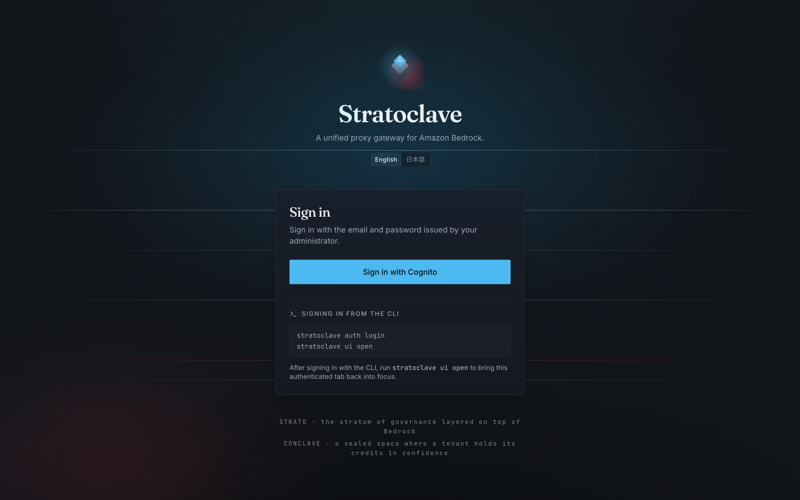
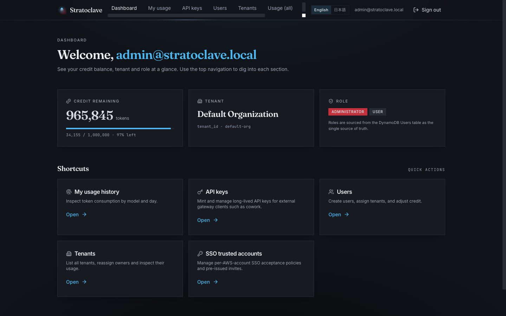
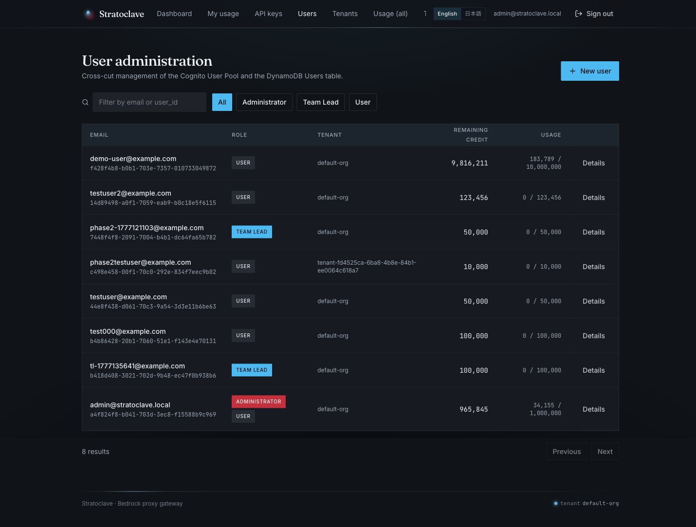
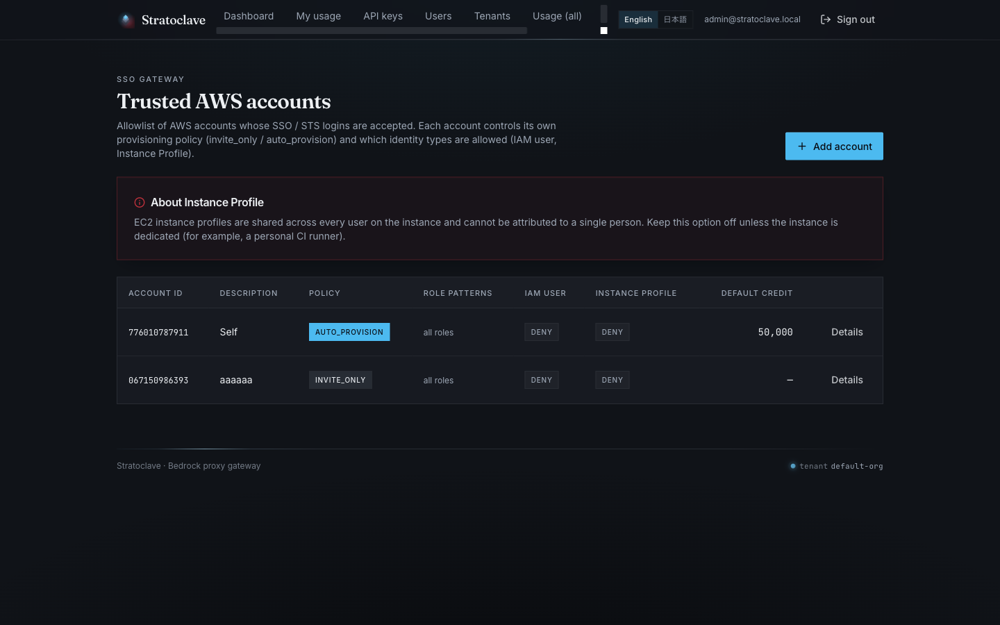
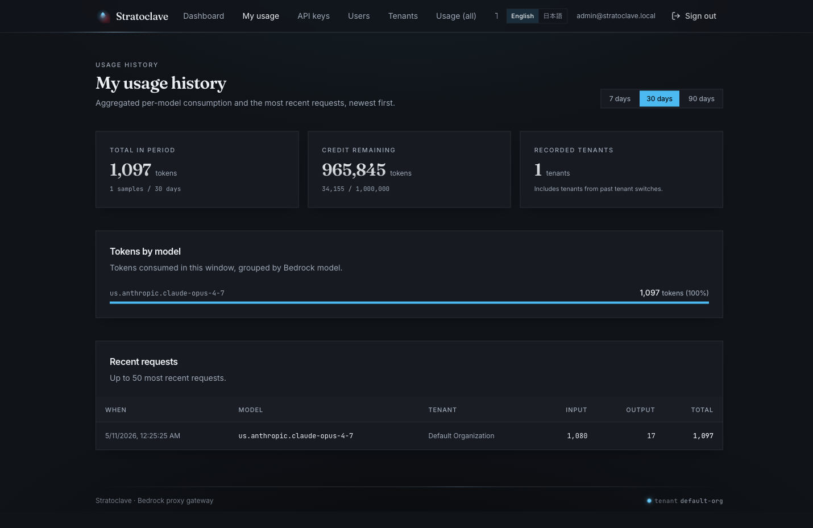

<div align="center">

# Stratoclave

**Amazon Bedrock proxy gateway with tenant-level credit management**

<sub>*Strato (岩盤) × Conclave (秘密集会) — Bedrock の上に重なる管理の地層、テナントに閉ざされた秘密空間でクレジットを統べる*</sub>

<br/>



</div>

---

Stratoclave は、**Amazon Bedrock を組織で共有利用するためのプロキシゲートウェイ** です。
`aws sso login` 済みのユーザーが追加パスワードなしでシームレスに利用でき、
管理者はテナント・ユーザー単位のクレジット割当と使用量を一元管理できます。

## なぜ Stratoclave?

IAM で Bedrock に直接アクセスできるユーザーでも、**誰が・どのモデルを・どれくらい使ったか** を
組織として把握することは容易ではありません。Stratoclave は Bedrock への入り口を一本化し、
テナントとユーザーというレイヤーで利用量を可視化・統制します。

```
  ユーザー                    Stratoclave                      Amazon Bedrock
┌─────────┐                 ┌─────────────────┐                ┌─────────────┐
│ CLI /   │  ── JWT ──▶   │  RBAC             │  ─ IAM ─▶   │ Claude      │
│ Web UI  │                 │  Credit Quota     │                │ (Opus / ..) │
└─────────┘                 │  Audit Log        │                └─────────────┘
                            └─────────────────┘
```

## 主な特徴

### 🗝 2 通りのログイン方式
- **Cognito User Pool (email / password)** — 管理者が発行した一時パスワードで初回ログイン、本人が新パスワードを設定
- **AWS SSO / STS シームレスログイン** — `aws sso login` 済みのシェルから `stratoclave auth sso` 一発で認証、**パスワード不要**

### 🏛 テナント × ユーザーの 2 階層 RBAC
- **admin / team_lead / user** の 3 ロール
- テナント (= 組織の単位) ごとに独立した **デフォルトクレジット**、ユーザーごとの **個別上書き**
- **Team Lead** は自分が所有するテナントのみ可視 (他テナントは存在すら見えない)
- ロールとパーミッションは DynamoDB を真実源とし、`permissions.json` から差分同期

### 🛡 SSO Gateway (Trusted Account allowlist + Hybrid provisioning)
- AWS Account ID 単位で **信頼アカウント** を Admin が事前登録
- `AWSReservedSSO_*` / `federated_role` / `iam_user` / `instance_profile` を識別、
  **EC2 Instance Profile は default DENY** (複数ユーザー共有は追跡不能のため)
- 招待ベースの `invite_only` と自動 provision の `auto_provision` を **hybrid** で併用可能
- Isengard / 社内 SAML のように session が email でない環境も、招待で明示 map して通過させられる

### 📊 使用量の可視化
- `Messages API` 呼び出しごとに input/output トークンを DynamoDB に記録
- 自分の使用履歴 (ユーザー)・所有テナントの集計 (Team Lead)・全 UsageLogs (Admin) をフィルタ可能
- Audit log は CloudWatch に構造化 JSON で保存

### ⚒ Anthropic Messages API 互換
- `POST /v1/messages` エンドポイントを提供し、Claude SDK / Claude Code から `ANTHROPIC_BASE_URL` の差し替えだけで利用可能
- 内部で Bedrock Inference Profile (Opus 4.5 / 4.6 / 4.7、Sonnet 4.5 / 4.6、Haiku 4.5) にルーティング

## スクリーンショット

### ダッシュボード


### ユーザー管理 (Admin)


### 信頼する AWS アカウント (SSO Gateway)


### 自分の使用履歴


より多くのスクリーンショットは [docs/ADMIN_GUIDE.md](docs/ADMIN_GUIDE.md) を参照してください。

## クイックスタート

### サービスを使う側 (ユーザー / 管理者)

1. 管理者から発行された一時パスワード or `aws sso login` 済みの環境を用意
2. CLI をビルド: `cd cli && cargo build --release`
3. ログイン:
   ```bash
   # 方法 A: email / password
   stratoclave auth login --email you@example.com

   # 方法 B: AWS SSO 経由 (aws sso login 済みであること)
   stratoclave auth sso --profile company
   ```
4. Web UI を開く: `stratoclave ui open`
5. Claude Code を Stratoclave 経由で起動 (Claude Code が別途インストール済であること):
   ```bash
   stratoclave claude -- "Hello"
   ```

詳細は [docs/GETTING_STARTED.md](docs/GETTING_STARTED.md) と [docs/CLI_GUIDE.md](docs/CLI_GUIDE.md) を参照してください。

### 自分の AWS アカウントにデプロイしたい場合

1. AWS アカウント (us-east-1 で Bedrock 利用権限)、AWS CDK v2、Node.js 20+、Python 3.11+、Rust、finch (または Docker) を用意
2. 以下を実行:
   ```bash
   export AWS_PROFILE=your-profile \
     AWS_REGION=us-east-1 AWS_DEFAULT_REGION=us-east-1 \
     CDK_DEFAULT_REGION=us-east-1 \
     STRATOCLAVE_PREFIX=stratoclave

   cd stratoclave
   ./scripts/deploy-all.sh
   ./scripts/bootstrap-admin.sh
   ```
3. 詳細な手順、トラブルシューティングは [docs/DEPLOYMENT.md](docs/DEPLOYMENT.md)

## ドキュメント

| ドキュメント | 用途 |
|---|---|
| [docs/GETTING_STARTED.md](docs/GETTING_STARTED.md) | 初めて使う方向け、ログイン〜Claude 呼び出しまで |
| [docs/ADMIN_GUIDE.md](docs/ADMIN_GUIDE.md) | 管理者向け、ユーザー / テナント / SSO / 使用量管理 (スクリーンショット付き) |
| [docs/CLI_GUIDE.md](docs/CLI_GUIDE.md) | `stratoclave` CLI の全サブコマンドリファレンス |
| [docs/COWORK_INTEGRATION.md](docs/COWORK_INTEGRATION.md) | Claude Desktop の Cowork を Stratoclave 経由で Bedrock に繋ぐ手順 |
| [docs/DEPLOYMENT.md](docs/DEPLOYMENT.md) | 自分の AWS に Stratoclave を立てる手順 |
| [docs/ARCHITECTURE.md](docs/ARCHITECTURE.md) | 全体アーキテクチャと各層の責任 |
| [docs/PROJECT_STATUS.md](docs/PROJECT_STATUS.md) | 実装フェーズごとの現在地 |
| [docs/PROJECT_RULES.md](docs/PROJECT_RULES.md) | プロジェクト開発ルール |

設計背景に関心のある方:
- [DESIGN_PHASE2_RBAC_TENANTS.md](DESIGN_PHASE2_RBAC_TENANTS.md) — RBAC / Tenant 設計
- [DESIGN_PHASE_S_SSO.md](DESIGN_PHASE_S_SSO.md) — AWS SSO / STS Gateway 設計 (Hybrid 反映済)

## 技術スタック

| 領域 | 技術 |
|------|------|
| Backend | FastAPI (Python 3.11), boto3, Pydantic v2, PyJWT |
| Frontend | Vite 5 + React 18 + TypeScript, Tailwind v3, shadcn/ui, TanStack Query, Fraunces / Inter |
| CLI | Rust (clap derive), aws-sdk-sts, aws-sigv4, reqwest |
| IaC | AWS CDK v2 (TypeScript) |
| Compute | ECS Fargate (Public Subnet, minimum VPC) |
| Storage | DynamoDB (12 テーブル、PAY_PER_REQUEST) |
| Authentication | Cognito User Pool (access_token のみ受理、`cognito:groups` は使用しない) |
| CDN / Delivery | CloudFront + SPA fallback (CloudFront Function) |
| Container | finch (Docker 互換) または Docker |

## 開発ポリシー

- **ハードコード禁止**: account id / region / ARN / domain はコミット前に `scripts/check-hardcode-all.sh`
- **access_token のみ**: Backend は id_token を受け付けない (OAuth 2.0 作法)
- **DynamoDB がロールの真実源**: Cognito Group は使わず、`Users.roles: list[str]` を参照
- **RBAC resource 名に `-` `_` 禁止**: ワイルドカード誤マッチ防止
- **UI は "Strato × Conclave" 世界観を統一**: Fraunces 見出し / sharp corners on data / glacier blue primary / cardinal red accent
- 詳細: [docs/PROJECT_RULES.md](docs/PROJECT_RULES.md)

## ライセンス

Apache License 2.0 (TBD)

## 謝辞

- [AWS Bedrock](https://aws.amazon.com/bedrock/) — モデル配信基盤
- [HashiCorp Vault aws auth method](https://developer.hashicorp.com/vault/docs/auth/aws) — "Vouch by STS" パターンの原点
- [shadcn/ui](https://ui.shadcn.com/) — Frontend UI プリミティブ
- [Fraunces](https://fonts.google.com/specimen/Fraunces) — Display フォント
