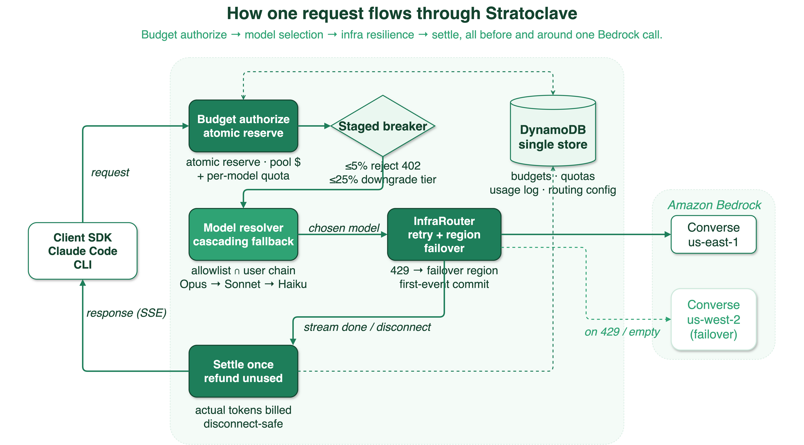

<div align="center">

# Stratoclave

**A tenant-aware credit gateway for Amazon Bedrock.**

[](./LICENSE)
[](#project-status)
[](./backend)
[](./cli)
[](./iac)
[](#api-compatibility)
[](#api-compatibility)
[](#api-compatibility)

</div>

---

## Overview

Stratoclave is a self-hosted **inference gateway** that sits in the data path
in front of Amazon Bedrock and adds the three things raw Bedrock does not give
you on its own: **who called which model, under whose budget, and through
which identity** — enforced *before* the model is invoked, on every single
request.

It exposes three inference routes: an Anthropic `Messages API`-compatible
endpoint at `/v1/messages` (for the Anthropic SDKs, Claude Code, and Claude
Desktop Cowork), an OpenAI `Chat Completions`-compatible endpoint at
`/v1/chat/completions` (for the OpenAI SDK, on the same Bedrock converse
backend), and an OpenAI Responses API-compatible endpoint at
`/openai/v1/responses` (for the `codex` CLI, backed by GPT-5.x on Amazon
Bedrock via the bedrock-mantle service). Every route enforces per-user token
quotas and optional per-tenant **dollar pool** and **per-model** budgets with
atomic DynamoDB reservations; **streaming** Bedrock calls additionally get
retry + cross-region failover with quota-driven per-model fallback (the
non-streaming Anthropic path is single-region — see the comparison table).
Every call is recorded as a structured JSON log to CloudWatch, and three
orthogonal identity paths are accepted: Amazon Cognito password, AWS identity
attestation via a Vault-style STS vouch (aws sso / saml2aws / IAM user — **not**
SAML/OIDC SSO to Stratoclave itself), and long-lived `sk-stratoclave-*` keys.

Stratoclave is deliberately AWS-native and small: a single region in your own
account, one FastAPI service on ECS Fargate, DynamoDB for all state, Cognito
for token issuance, and AWS CDK v2 for the entire topology. There is no
Postgres, no Redis, no external control plane, and no SaaS dependency.

### The one thing that is hard to replicate: pre-flight, atomic budget enforcement

If you are embedding AI into a SaaS product, inference is a **variable cost of
goods** — AI-feature gross margins sit near ~50% versus 80–90% for classic SaaS,
and *who pays that variable cost, and how you cap it* is the whole game. That
makes per-tenant cost control not a nice-to-have but the P&L core, and it is a
distributed-systems problem: *record the billable event across a trust boundary,
exactly once, against the right tenant, non-repudiably*.

Stratoclave's differentiator is narrow but real and **not something a competitor
can bolt on from outside**: it reserves a tenant dollar pool **+** per-user token
quota **+** per-model dollar quota in a **single DynamoDB `TransactWriteItems`
before the model is invoked**. There is no client bypass and no
check-then-act (TOCTOU) overspend race — an overshoot loses the conditional
write and gets a `402`. A credential broker cannot do this at all (nothing is in
the data path); a general-purpose proxy that checks a cached spend counter
pre-call still has a race window under concurrency, so its budget is a soft
limit, not a hard one. Judged purely on *shipped* capability (not "could be
implemented"), Stratoclave is today the only one of the three that enforces the
budget atomically at request time.

Mapped to the canonical five-layer AI-billing gateway, Stratoclave now ships
all five layers:

| Layer | What it is | Stratoclave |
| --- | --- | --- |
| 1. Billing gateway | Proxy all I/O; keep metering out of app code | **Shipped** — every route terminates here |
| 2. Context propagation | Carry tenant / run / budget across hops | **Shipped** — `x-sc-group-id` / `x-sc-workflow-run-id`, hard `x-sc-model-pin` |
| 3. Budget enforcement | Two-phase authorize/capture + staged breaker | **Shipped** — atomic pre-flight reserve + settle, staged budget breaker; also exposed as an [external authorize/capture API](#external-authorizecapture-api-layer-5) |
| 4. Credit ledger | Idempotent, event-sourced balance history | **Shipped** — dedicated append-only ledger table; every money move (RESERVE/SETTLE/RELEASE/RECLAIM/LATE_SETTLE) is one immutable event written in the same `TransactWriteItems` as the counter it moves |
| 5. Rating + revenue recognition | Physical usage → money, cost passthrough | **Shipped** — rate frozen at reserve, versioned rating on the ledger terminal, per-run read API + provider-cost passthrough, and a routing decision log that makes router savings *provable* |

## Why a gateway? (what a credential broker cannot do)

There are two ways to put Claude Code / codex on Bedrock in front of an
organization. A **credential broker** (such as the AWS *Guidance for Claude
Code with Amazon Bedrock*) hands each machine short-lived STS credentials and
lets the client call Bedrock **directly** — nothing sits in the data path.
Stratoclave takes the other route: it is a **gateway** that terminates every
inference call. That single architectural choice is what unlocks the
following, none of which a broker can offer because it has no request-time
choke point:

- **Real tenants, not just users.** `admin tenant create` provisions a tenant
  as a first-class object; users are assigned into it and can be moved between
  tenants atomically (`TransactWriteItems`). A broker has only the identity the
  IdP already emits — there is no "tenant" to create, budget, or reassign.
- **Budget enforced *per request*, before the call — not after.** Every call
  reserves `max_tokens + input_estimate` with a conditional DynamoDB write
  *before* Bedrock is invoked, and refunds the unused remainder afterwards.
  Concurrent requests that would overshoot a quota lose the conditional write
  and are rejected with `402`. A broker can only check a counter at credential
  **refresh** time (≈ every hour), and its usage numbers come from client-side
  telemetry the user can simply stop sending.
- **Both Claude and codex through one control plane.** The same identity,
  budget, and audit primitives cover the Anthropic Messages API *and* the
  OpenAI Responses API (GPT-5.x via bedrock-mantle). A Bedrock credential
  broker is Anthropic-only.
- **App-layer model / capability policy.** The model allowlist, and (on the
  roadmap) per-tenant reasoning-effort and tool caps, are enforced in the
  request handler. IAM can allow or deny a *model ARN*, but it cannot express
  "this tenant may not use `reasoning.effort = xhigh`".
- **A web console for non-engineers.** Tenants, users, credit, API keys and
  usage are managed from a React admin UI, not only a CLI.

The trade-off is honest and stated up front: a gateway is a component **you**
run and secure, it sits on the availability path of every call, and it sees
prompt text. See [Non-goals and honest limitations](#non-goals-and-honest-limitations)
and [Stratoclave vs. LiteLLM vs. a credential broker](#stratoclave-vs-litellm-vs-a-credential-broker)
for where a broker is the better choice.

## Highlights

- **Anthropic-compatible endpoint.** `POST /v1/messages` and `GET /v1/models`
  accept the same payloads as `api.anthropic.com`. Point `ANTHROPIC_BASE_URL`
  at your deployment and the Anthropic SDKs, Claude Code, and Claude Desktop
  work unchanged. Supports streaming, tool calling, vision (base64
  images), extended thinking, and prompt caching (`cache_control`).
- **OpenAI Chat Completions endpoint.** `POST /v1/chat/completions` accepts
  the same payloads as the OpenAI Chat Completions API — point
  `OPENAI_BASE_URL` at your deployment and use the OpenAI SDKs directly.
  Supports streaming, tool calling (including streaming `tool_calls`
  chunks), system messages, and `stop` sequences. Unsupported parameters —
  `n > 1`, `logprobs`, `response_format`, `image_url` content parts, and
  `parallel_tool_calls: false` — are rejected with an explicit 400 rather
  than silently dropped, so incompatible requests fail loudly instead of
  degrading quietly. For vision, use `/v1/messages` with base64 images.
  Both endpoints route to the same backend, so model behavior, limits, and
  credit accounting are identical regardless of which API shape you use.
  Auth: set your Stratoclave API key (`sk-stratoclave-*`) as
  `OPENAI_API_KEY`. Model names use Bedrock identifiers (e.g.
  `us.anthropic.claude-sonnet-4-6`); see `GET /v1/models` for the full
  list.
- **OpenAI Responses API endpoint.** `POST /openai/v1/responses` and
  `GET /openai/v1/models` accept OpenAI Responses-API payloads and forward
  them to GPT-5.x models on Amazon Bedrock via the bedrock-mantle service
  (GPT-5.4 → us-west-2, GPT-5.5 → us-east-2). The `stratoclave codex` CLI
  subcommand wraps the `codex` binary against this endpoint with an ephemeral
  key; the `--codex` flag on `stratoclave setup` patches `~/.codex/config.toml`
  for direct use. Controlled by the `CODEX_ENABLED` ECS env flag, which
  **defaults to `true`**; set `CODEX_ENABLED=false` to disable the OpenAI
  routes (they then return `503`).
- **Two-level credit governance, enforced pre-flight.** Every tenant has a
  default credit, every user can carry a per-user override, and every
  inference call — to `/v1/messages` (Anthropic), `/v1/chat/completions`
  (OpenAI Chat), or `/openai/v1/responses` (OpenAI Responses) — reserves
  tokens atomically with a conditional DynamoDB write
  *before* Bedrock is invoked (`backend/dynamo/user_tenants.py:reserve`).
  Unused credit is refunded from the real token counts on return. Because the
  reservation is a conditional `UpdateItem`, concurrent requests that would
  push a balance past its limit lose the condition and are rejected — quotas
  cannot be raced past.
- **Dollar pool budgets, priced per model.** A tenant can additionally carry a
  shared **dollar pool** for a billing period. Each request debits the caller's
  per-user tokens *and* reserves the request's cost in integer micro-USD from
  the pool in **one** `TransactWriteItems`, so neither ceiling can be raced
  past; a breach returns `402` with a `reason` distinguishing
  `personal_budget_exhausted` from `tenant_pool_exhausted`. Cost is derived from
  an admin-editable per-model price table (`PricingConfig`), so Opus and Haiku
  spend are counted differently — all in integer micro-USD, never floating
  point. A tenant with no pool row keeps the token-only behaviour unchanged
  (pools are opt-in per tenant/period).
- **Infrastructure resilience — retry, cross-region failover (streaming path).**
  Streaming requests flow through an **InfraRouter** that wraps the Bedrock
  call: a `ThrottlingException` (429), `ServiceUnavailableException`, timeout,
  or empty stream **fails over to the same model in another region** (e.g.
  `us-east-1 → us-west-2`), which is a fresh throttle bucket. A **first-event
  commit** rule guarantees that once the first stream byte is sent, the target
  is locked — a mid-stream failure never silently re-runs the model or
  double-bills. `ValidationException`/`AccessDenied` are fatal and fail fast.
  Retries are invisible to the client: same SSE shape, one settle, actual
  tokens only. **Scope, stated honestly:** failover applies to the *streaming*
  paths; the **non-streaming** requests (`/v1/messages`, `/v1/chat/completions`,
  `/openai/v1/responses` — all on the shared converse core) are a single Bedrock
  call with no region failover (an error refunds and surfaces the status). The
  failover region set is **operator-configured** via
  `STRATOCLAVE_FAILOVER_REGIONS` (comma-separated). When unset, the built-in
  defaults are **filtered to the model primary region's jurisdiction**, so a
  non-US primary (e.g. `eu-west-1`) never silently fails over into another
  jurisdiction. An explicit list is honoured verbatim. For single-region **data
  residency**, set it to a same-jurisdiction list or to **`none`** (or an empty
  string) **to disable failover entirely** — then a streaming request never
  sends prompt bytes outside the primary region. The effective set is logged at
  startup as `failover_regions_effective`. See
  [docs/DEPLOYMENT.md](./docs/DEPLOYMENT.md#regional-constraints) for the full
  residency recipe.
- **Staged budget breaker.** An advisory budget check shapes routing before
  the atomic reserve: at **≤25% remaining** it caps the model tier, at **≤5%**
  it rejects with `402` before any Bedrock call. This is live today.
- **Per-model quotas + cascading model fallback.** "Use Opus until its per-model
  budget is gone, then Sonnet, then Haiku." Each model has an optional per-tenant
  (and per-user) quota, charged in the *same* atomic `TransactWriteItems` as the
  budget reserve — so a request can never race past a per-model limit. When a
  model's quota is exhausted the request cascades to the next model in the
  tenant/user chain; each candidate is priced and settled at *its own* rate, and
  the request is served by the model actually reserved. Live today across the
  Anthropic Messages, OpenAI Chat Completions, and Responses routes.
- **Crash-resilient budget accounting.** A pooled reservation writes a sibling
  *hold* record in the same atomic write; settle and release delete it, and if
  a task is killed (OOM, deploy drain) between reserve and settle, a bounded,
  self-healing sweep on later requests reclaims the orphaned hold so a crash
  can never permanently strand pool budget — with no reaper process, timer, or
  any infrastructure beyond the single DynamoDB table.
- **Three role RBAC, tenant-scoped.** `admin`, `team_lead`, and `user` roles
  are normalized into DynamoDB from a versioned
  [`permissions.json`](./backend/permissions.json). Team leads see only the
  tenants they own; other tenants respond 404 even by direct URL.
- **Three identity paths, one backend.** Cognito email + password, passwordless
  AWS SSO (and saml2aws, and any AWS profile) through the Vouch-by-STS flow,
  and long-lived `sk-stratoclave-*` API keys with scope narrowing and
  per-user active-key caps.
- **Claude Desktop Cowork ready.** Cowork's Gateway mode discovers the model
  list via `/v1/models` and streams through `/v1/messages`. A CloudFront
  Function guards against the `/v1/v1/...` double-prefix pitfall.
- **CDK v2, one command.** A single `./scripts/deploy-all.sh` from
  [`iac/`](./iac) provisions the VPC (with Flow Logs), DynamoDB tables, ECR
  repository, ALB, **WAFv2 WebACL (CloudFront scope)**, CloudFront + S3
  frontend, Cognito User Pool, and the Fargate service in a single AWS
  region. `cdk-nag` runs at every synth so regressions in security posture
  fail the build.
- **Defense in depth at the edge.** CloudFront terminates TLS at 1.2_2021+.
  The SPA responses carry HSTS 730 d + preload and a strict CSP via a
  CloudFront `ResponseHeadersPolicy`; the API responses carry their own
  headers from the backend middleware (HSTS 365 d, `script-src 'none'`,
  `frame-ancestors 'none'`). A managed WAFv2 WebACL applies four rules by
  default — CommonRuleSet, KnownBadInputs, IpReputation, and a per-IP
  rate-limit rule (an optional IP-allowlist rule makes five). The S3 origin
  uses **Origin Access Control** with a bucket policy scoped by both
  `aws:SourceArn` and `aws:SourceAccount`, and the ALB security group only
  accepts the AWS-managed CloudFront origin-facing prefix list — direct ALB
  DNS probes fail at L4. The Fargate task's own egress is locked to TCP/443
  and UDP/53 (`allowAllOutbound: false`).
- **Auditable by construction.** Every privileged action is emitted as a
  structured JSON log to CloudWatch, keyed by the correlation ID the backend
  injects on ingress. Emails are redacted into stable SHA-256 markers so
  logs never leak PII.

## Architecture at a glance

<p align="center">
  
</p>

The Stratoclave control plane lives inside a **single AWS region of your
choice** (`STRATOCLAVE_REGION`, default `us-east-1`) in your own account. Only
the WAF stack is pinned to `us-east-1`, because AWS requires CLOUDFRONT-scope
WebACLs to live there; every other stack deploys to your chosen region. Clients
reach CloudFront for TLS termination; static paths hit S3, API paths hit an
internal ALB fronting a Fargate service that runs at least two tasks spread
across availability zones. The backend is stateless — all mutable state lives in
DynamoDB, authenticated by either a Cognito `access_token` or a
`sk-stratoclave-*` API key.

Inference fans out to two Bedrock surfaces, and the **Bedrock model region is
independent of the deploy region** (`BEDROCK_PRIMARY_REGION`). Anthropic Messages
(`/v1/messages`) and OpenAI Chat Completions (`/v1/chat/completions`) share a
single Bedrock `converse` / `converseStream` backend against an
inference-profile allowlist — different wire shapes, one control core. OpenAI
Responses calls (`/openai/v1/responses`) are forwarded by httpx to the
bedrock-mantle service at `bedrock-mantle.{region}.api.aws/openai/v1`, where the
region is per-model (GPT-5.4 → us-west-2, GPT-5.5 → us-east-2). All Bedrock calls
originate from the single Fargate task; no second control-plane region is
deployed. When the deploy region differs from `us-east-1`, the WAF WebACL is
consumed cross-region by the CloudFront distribution via CDK
`crossRegionReferences` (a no-op when they coincide).

### One request, end to end

Every call passes through the same money-and-routing pipeline: **budget
authorize → staged breaker → model selection → infrastructure retry/failover →
settle**, wrapped around exactly one Bedrock invocation. Retries and
cross-region failover (on the streaming path; the non-streaming Anthropic call
is single-region) are invisible to the client; the reservation settles once
against actual usage, even on mid-stream disconnect. The *model selection* stage
resolves the requested model and, when a per-model quota is exhausted, cascades
down the tenant/user fallback chain — reserving and settling each candidate at
its own price and serving the model actually reserved.

**Model pinning & passthrough.** Two escape hatches from routing policy:

- **Hard pin** — send `x-sc-model-pin: <model>` and the request runs on exactly
  that model: no cascade, no chain rewrite, no breaker downgrade, no
  quota-exhaustion fallback. The pin is validated against the tenant allowlist
  (`403` if not allowed) and the route's wire protocol (`400` if unservable) —
  it is never silently substituted. Pricing and per-model quota apply at the
  pinned model's own rate. Absent header ⇒ normal routing.
- **Passthrough mode** — a tenant with no chain, no quotas, and fallback off is
  served its requested model on every request, with no fallback or downgrade
  (an allowlist may still be configured purely as a gate). This is the default
  degenerate configuration; it needs no special setup and is locked by test.

<p align="center">
  
</p>

For a detailed walkthrough of components, data model, and invariants, see
[`docs/ARCHITECTURE.md`](./docs/ARCHITECTURE.md).

## Quick start

### Deploy to your AWS account

Prerequisites: AWS CLI with an administrator profile, Node.js 20 LTS, Docker,
and Bedrock model access enabled for the Claude family in your region.

```bash
# Clone
git clone https://github.com/littlemex/stratoclave.git
cd stratoclave

# Set your profile / region / deployment prefix. The body stacks deploy to
# STRATOCLAVE_REGION (default us-east-1); the WAF stack is always us-east-1.
# For a non-us-east-1 deploy you must also set BEDROCK_PRIMARY_REGION and
# `cdk bootstrap` both regions — see "Regional constraints" in docs/DEPLOYMENT.md.
export AWS_PROFILE=your-admin-profile
export STRATOCLAVE_REGION=us-east-1
export AWS_DEFAULT_REGION=us-east-1
export CDK_DEFAULT_REGION=us-east-1
export CDK_DEFAULT_ACCOUNT=$(aws sts get-caller-identity --query Account --output text)
export STRATOCLAVE_PREFIX=stratoclave

# One-shot deploy: network (+ Flow Logs), DynamoDB, ECR, ALB, WAF,
# CloudFront (OAC), Cognito, Fargate. cdk-nag runs during synth.
cd iac
npm install
./scripts/deploy-all.sh
```

The script prints the CloudFront URL at the end — hand that URL to your CLI
users. The first admin user is seeded by a bootstrap script in
[`iac/scripts/`](./iac/scripts); see [`docs/DEPLOYMENT.md`](./docs/DEPLOYMENT.md)
for day-2 operations.

### Use it from the CLI

```bash
# Build the Rust CLI (pre-built releases will follow)
cd cli
cargo build --release
export PATH="$PWD/target/release:$PATH"

# Bootstrap config from /.well-known/stratoclave-config
stratoclave setup https://d111111abcdef8.cloudfront.net

# (Optional) Also patch ~/.codex/config.toml for direct codex use
stratoclave setup https://d111111abcdef8.cloudfront.net --codex

# Sign in (pick one path)
stratoclave auth login --email you@example.com               # Cognito password
stratoclave auth sso   --profile your-aws-sso-profile        # AWS SSO / saml2aws

# Run Claude Code through Stratoclave (claude-code must be installed separately)
stratoclave claude -- "Summarize this repository in one sentence"

# Run OpenAI codex through Stratoclave (codex must be installed separately).
# Mints a short-lived responses:send-only key; ~/.codex/config.toml is untouched.
stratoclave codex -- "Summarize this repository in one sentence"

# Open the web console in a pre-authenticated tab
stratoclave ui open
```

### Use it from the Anthropic SDK

```python
import anthropic

client = anthropic.Anthropic(
    base_url="https://d111111abcdef8.cloudfront.net",
    api_key="sk-stratoclave-xxxxxxxx...",  # issue via CLI or web console
)
resp = client.messages.create(
    model="claude-sonnet-4-6",
    max_tokens=1024,
    messages=[{"role": "user", "content": "Hello"}],
)
print(resp.content[0].text)
```

### Use it from the OpenAI SDK / codex

```python
import openai

client = openai.OpenAI(
    base_url="https://d111111abcdef8.cloudfront.net/openai/v1",
    api_key="sk-stratoclave-xxxxxxxx...",  # issue via CLI or web console
)
resp = client.responses.create(
    model="openai.gpt-5.4",
    input="Hello",
)
print(resp.output_text)
```

The `responses:send` scope is required; all three roles (`admin`, `team_lead`,
`user`) carry it by default. GPT-5.4 is served from us-west-2 and GPT-5.5
from us-east-2 via the bedrock-mantle service; both are gated by the
`CODEX_ENABLED` feature flag on the ECS task. See
[`docs/CODEX_GUIDE.md`](./docs/CODEX_GUIDE.md) for the full codex setup.

For a complete walkthrough including the web console, administrative
workflows, Cowork configuration, and codex setup, see
[`docs/GETTING_STARTED.md`](./docs/GETTING_STARTED.md).

## How it works

### Vouch by STS (passwordless login)

Stratoclave's SSO flow does not parse AWS credentials and never holds an IdP
refresh token. It is the same pattern
[HashiCorp Vault has used for a decade](https://developer.hashicorp.com/vault/docs/auth/aws)
in its AWS `iam` auth method: the client signs
`sts:GetCallerIdentity`, the backend replays the signed request to STS, and
the backend trusts only the `Arn` / `UserId` / `Account` that STS returns.

<p align="center">
  
</p>

This is what makes the SSO path identity-provider agnostic. Anything that
populates `~/.aws/credentials` works the same way: `aws sso login`,
`saml2aws login`, Entra ID / Okta / ADFS SAML federation, a regular IAM user
with long-lived keys (default DENY unless explicitly allowed per trusted
account), and so on. EC2 instance profiles are rejected by default because
they cannot be attributed to a single human.

Because Stratoclave never stores an IdP refresh token, a full backend
compromise cannot pivot into the customer's IAM Identity Center or SAML IdP.
The worst-case blast radius is bounded to Stratoclave's own resources —
Bedrock overspend, DynamoDB tampering, impersonation within this deployment.
See [`SECURITY.md`](./SECURITY.md) and the *Security considerations* section
of [`docs/ARCHITECTURE.md`](./docs/ARCHITECTURE.md) for the full threat
model.

### Credit reservation

Concurrent requests that would overshoot a quota cannot race. Both
inference routes share the same reservation pipeline (`backend/mvp/_pipeline.py`):
the request reserves `max_tokens + input_estimate` with a conditional
`UpdateItem` on `UserTenants`, invokes the upstream service (Bedrock
`converse` for `/v1/messages`, bedrock-mantle Responses for
`/openai/v1/responses`), then refunds the difference from the real token
counts. `UsageLogs` always records the actual spend, not the reservation.

The OpenAI Responses route applies a reasoning-effort multiplier to the
upfront reservation (1× / 2× / 4× / 8× for `low` / `medium` / `high` /
`xhigh`) because reasoning traces can emit far more output tokens than
`max_output_tokens` alone implies. The minimum reservation is 8 192 tokens
per request regardless of multiplier.

<p align="center">
  
</p>

The credit model, role matrix, and the underlying DynamoDB tables are
documented in [`docs/ARCHITECTURE.md`](./docs/ARCHITECTURE.md) and
[`docs/ADMIN_GUIDE.md`](./docs/ADMIN_GUIDE.md).

### Dollar pool budgets and crash-safe accounting

When a tenant has a **dollar pool** for the current period, the same
reservation additionally reserves the request's cost — priced from the
per-model `PricingConfig` table — as integer **micro-USD** (1 USD =
1 000 000 micro-USD; never a float, and cost is rounded *up* so a request is
never under-charged). The per-user token debit and the pool debit are one
`TransactWriteItems`: either both commit or neither does, so under concurrency
a tenant can no more overshoot its dollar pool than a user can overshoot their
token balance. On settle, the reserved amount is released and the *actual*
cost — including cache-read/write tokens — is recorded to `pool_settled`.

Because a reservation is money held before the model call, a process killed
between reserve and settle (OOM, deploy drain) would otherwise strand that
amount forever. To prevent that **without adding any infrastructure**, each
reservation writes a sibling *hold* row in the same atomic write, carrying its
amount and an expiry encoded in the sort key. Settle and release delete the
hold in the same transaction that adjusts the pool. A killed request leaves its
hold behind; later pooled requests run a small, bounded **sweep** that reclaims
expired holds — decrement and delete in one conditional transaction, so a hold
is reclaimed at most once and the pool can never be double-credited or driven
negative, even when many requests sweep concurrently. There is no reaper
process, no timer, and no store beyond the single `TenantBudgets` table.

Set a pool with `stratoclave admin tenant pool-budget set` or the web console;
the `TenantBudgets` schema and the reclaim invariants are documented in
[`docs/ADMIN_GUIDE.md`](./docs/ADMIN_GUIDE.md) and
[`docs/ARCHITECTURE.md`](./docs/ARCHITECTURE.md).

### External authorize/capture API (Layer 5)

The same atomic reserve that gates an LLM request is also exposed as a
**two-phase external charge** so a tenant can hold budget for a *non-LLM*
action — a batch job, a third-party API call, any billable unit — and settle it
later from its own workflow:

```
POST /api/mvp/billing/authorize          # hold $X (Idempotency-Key required)
POST /api/mvp/billing/authorizations/{id}/capture   # settle the actual amount (≤ authorized)
POST /api/mvp/billing/authorizations/{id}/void      # release without charge
GET  /api/mvp/billing/authorizations/{id}           # authorized | captured | voided | expired
```

The design rule is that **the money logic is not forked**: capture reuses the
exact settle path an inline request uses, and void reuses the exact release
path — only the reservation context's *construction* differs (rehydrated from
the credit ledger across two HTTP calls, rather than held in memory within
one). So the ledger's "exactly one terminal per hold" mutual exclusion and the
frozen-rating guarantees carry over unchanged; the only genuinely new money
code is one idempotency record and the rehydrate.

- **`authorization_id`** is an opaque token that self-describes its hold. It is
  addressing, not authorization — every ledger read is scoped to the
  authenticated tenant's partition, so a token can only ever reach the caller's
  own holds, and only holds this API itself created (an inline LLM hold's token
  is rejected). Idempotent authorize is enforced by an idempotency record
  written in the same transaction as the reserve, with a request fingerprint so
  reusing a key for a *different* body is a `422`, never a silent wrong replay.
- **Capture idempotency** is the ledger's single-terminal exclusion: a second
  capture, a capture-vs-void, or a capture racing the orphan-hold reaper all
  resolve deterministically (`200` replay / `409` / `410`). An expired
  (reaper-reclaimed) hold returns `410` and is deliberately **not** late-billed
  — an external capture window is unbounded, so late-billing a reclaimed hold
  could break the budget invariant.
- **The write verbs are rate-limited per source IP** (`authorize` / `capture` /
  `void`; `BILLING_WRITE_RATE_LIMIT`, default `60/minute`, backed by the same
  DynamoDB fixed-window limiter as the auth endpoints). Unlike an inline request
  these calls do no Bedrock work, so an un-capped `authorize → void` loop — even
  an accidental one from a buggy client that re-mints its `Idempotency-Key` each
  time — could saturate the single tenant-budget row's optimistic-concurrency
  retries and starve other users' inference in the same tenant. The cap bounds
  that contention while staying generous for legitimate programmatic use; the
  read-only `GET` is not capped.

The web console surfaces authorization status read-only (an `external` badge);
issuing authorize/capture stays programmatic (API/CLI:
`stratoclave billing authorize | capture | void | get`), since a money mutation
from a human form is a typo risk.

## API compatibility

| Endpoint                               | Behavior                                                            |
|----------------------------------------|---------------------------------------------------------------------|
| `POST /v1/messages`                    | Anthropic `Messages API` payload; translated to Bedrock `converse` / `converseStream`. Tools, vision (base64), thinking, prompt caching. Requires the `messages:send` scope. |
| `POST /v1/chat/completions`            | OpenAI `Chat Completions` payload on the **same** Bedrock converse backend. Streaming + tool calls. Unsupported params (`n>1`, `logprobs`, `response_format`, `image_url`) rejected with `400`, never silently dropped. Requires the `messages:send` scope. |
| `GET  /v1/models`                      | Returns the Claude-family inference profiles mapped by the backend. |
| `POST /openai/v1/responses`            | OpenAI Responses API payload; forwarded to `bedrock-mantle.{region}.api.aws/openai/v1`. Requires the `responses:send` scope. Gated by the `CODEX_ENABLED` ECS env flag. |
| `GET  /openai/v1/models`               | Returns OpenAI-family entries from the model registry, in the OpenAI `/v1/models` shape. Requires the `responses:send` scope. |
| `GET  /.well-known/stratoclave-config` | Unauthenticated discovery document; drives `stratoclave setup`.    |
| `POST /api/mvp/auth/sso-exchange`      | Vouch-by-STS entry point for CLI SSO login.                         |
| `GET  /api/mvp/me/billing/runs/{run_id}` | The caller's own per-run charge breakdown (frozen rating from the credit ledger; **no** provider cost / margin — redacted by response type). Requires `usage:read-self`. |
| `POST /api/mvp/billing/authorize`      | [External authorize](#external-authorizecapture-api-layer-5): reserve a fixed micro-USD amount from the tenant pool for a non-LLM action. `Idempotency-Key` header required. Requires `billing:write`. |
| `POST /api/mvp/billing/authorizations/{id}/{capture,void}` | Capture (settle, ≤ authorized) or void (release) an open authorization. Requires `billing:write`. |
| `GET  /api/mvp/billing/authorizations/{id}` | Authorization status (authorized / captured / voided / expired). Requires `billing:read`. |
| `/api/mvp/admin/*`                     | Admin and team-lead operations (user, tenant, credit, usage, trusted accounts, invites). |

The Claude family (via Bedrock `converse`) and the OpenAI family (via the
bedrock-mantle Responses API, currently `gpt-5.4` and `gpt-5.5`) are the
supported providers. Any model outside the explicit allowlist is rejected
with HTTP 400. The full registry lives in
[`backend/mvp/models.py`](./backend/mvp/models.py).

## Stratoclave vs. LiteLLM vs. a credential broker

Three different answers to "let my org use Claude/codex on Bedrock safely".
A **credential broker** (e.g. the AWS *Guidance for Claude Code with Amazon
Bedrock*) is not a proxy at all — it federates identities to short-lived STS
credentials and the client calls Bedrock directly. **LiteLLM** is a
general-purpose proxy across 100+ providers. **Stratoclave** is a focused,
AWS-native gateway that trades breadth for depth of per-tenant control.

| Dimension | Stratoclave | LiteLLM Proxy | AWS credential broker |
|---|---|---|---|
| Sits in the data path? | **Yes** (gateway) | **Yes** (gateway) | **No** (client → Bedrock direct) |
| Providers | Amazon Bedrock (Claude via `converse`; OpenAI GPT-5.x via bedrock-mantle) **+ a `served_by="vllm"` transport seam that binds a self-hosted GPU / any OpenAI-compatible endpoint to the _same_ reserve/rating/settle ledger** (ships dark). Fewer raw adapters than LiteLLM, but any bound backend flows through the formally-proven charge of record | 100+ (OpenAI, Anthropic, Bedrock, Vertex, Azure, Gemini, …) — more adapters, but their billing is best-effort | Amazon Bedrock, Anthropic models only |
| API surfaces | Anthropic Messages **+ OpenAI Chat Completions** (shared converse core) + OpenAI Responses | OpenAI Chat/Responses/Embeddings across providers | Native Anthropic Messages only |
| Tenants as a managed object | **Yes** — create / assign / reassign as a first-class object (reassignment is a `TransactWriteItems`) | Teams / orgs (global/team/user/key budgets) | **No** — only the IdP identity |
| Budget: bypass-proof? | **No client bypass** *and* **no overspend race** — pool + per-user tokens + per-model quota reserved pre-flight in one `TransactWriteItems` (optimistic snapshot lock; overshoot loses the write → `402`). A **hard** limit. | **No client bypass**, but the pre-call budget check reads a **cached spend counter**, so it is not atomic — a check-then-act (TOCTOU) window remains under concurrency. A **soft** limit at the margin | **Soft** — enforcement lives in IAM/SCP (model-ARN allow/deny); the dollar/usage counter is telemetry-based (checked at STS refresh, ~1 h), so it caps identity/model access, not spend at request time |
| Budget granularity | Dollar pool **+** per-user token **+** per-model micro-USD quota, priced per model | Per key/user/team `max_budget`, rpm/tpm | Per-user/team counter |
| Crash-safe budget accounting | **Yes** — a killed request's reservation self-heals via an *inline lazy* sweep on the reserve path (no separate reaper). Not instant: reclaim happens on the next reserve (≥ a 1800s TTL floor before a hold is sweep-eligible), so an idle tenant with no further traffic reclaims late, and a burst of crashes drains a few holds per reserve | Durable via its Postgres/Redis (more ops, but a real datastore) | N/A (no server-side reservation) |
| Resilience / routing | **Streaming:** retry + cross-region failover, first-event commit, staged breaker, and per-model fallback driven by the *same atomic budget reservation* (LiteLLM has budget-aware routing too; the distinctive part is the cascade being inside the pre-flight reserve). **Non-streaming: single-region, no failover** | Retries, fallbacks, latency/usage load-balancing, cooldowns — on **all** paths, across deployments *and* providers; battle-tested | None (client calls Bedrock; Bedrock CRIS only) |
| OpenAI codex on Bedrock | **Yes** — `stratoclave codex`, under the *same* budget/quota transaction (`responses:send` scope) | Via generic OpenAI routing (not budget-integrated the same way) | **No** |
| Per-request attribution / model pin | **Yes** — `x-sc-group-id` / `x-sc-workflow-run-id` correlation + hard `x-sc-model-pin` (VSR), on wrappers *and* pipe/chat; surfaced in usage as requested-vs-effective model | Tags/metadata + routing model choice | No (no request-time hook) |
| Model / capability policy | App-layer allowlist + per-tenant/user fallback chains (+ effort/tool caps on roadmap) | Per-key model list | IAM model-ARN allow/deny only |
| Identity (OSS, no paywall) | Cognito email/password + **Vouch-by-STS** (aws sso / saml2aws / IAM user): your existing AWS SSO / IdP federation authenticates the user, in the **OSS** build — AWS *identity attestation*, not a SAML assertion terminated by Stratoclave, but it does satisfy "only IdP-authenticated users may call". Plus `sk-stratoclave-*` keys | **SAML/OIDC SSO is Enterprise (paid)** — the OSS proxy has no SSO, only API keys | **Native OIDC/SAML federation**, free (this is the broker's core job) |
| Audit | **Structured JSON to CloudWatch** (correlation-id keyed, PII-hashed; queryable via Logs Insights) — not yet an immutable, purpose-built audit store (dedicated table on the roadmap) | Commercial tier: dedicated audit logs | **CloudTrail + Bedrock invocation logging** — AWS-native, tamper-evident, compliance-grade (every InvokeModel is recorded by the platform; strong for regulated audits) |
| State / ops footprint | **DynamoDB only** (serverless, pay-per-request), multi-task Fargate across AZs, **no Postgres, no Redis** | Stateless routing needs no DB, but **the budget / virtual-key / team features compared here require Postgres** (Redis recommended) | No data-path infra (just optional OTEL + quota Lambda) |
| Admin surface | **React web console** (tenants, users, credit, keys w/ revoke, routing config, read-only pricing) + CLI | Web UI + CLI | CLI (`ccwb`) |
| Fleet distribution (MDM, Claude Desktop) | Not built-in | Not built-in | **Yes** — MDM (Jamf/Intune/GPO), bootstrap server |
| Data residency / GovCloud | **Deploy region is operator-chosen** (`STRATOCLAVE_REGION`; only the CLOUDFRONT-scope WAF is pinned to us-east-1). **Bedrock model region is independent** (`BEDROCK_PRIMARY_REGION`). Streaming failover is configurable (`STRATOCLAVE_FAILOVER_REGIONS`), and the default set is jurisdiction-filtered so a non-US primary never back-doors to the US. `STRATOCLAVE_RESIDENCY=strict` fails the synth if any Bedrock call region (model + failover + codex) leaves the deploy region, or if the model is a geo inference profile. **aws partition only** (GovCloud/China rejected) | Wherever you host it | **US / EU / AU inference profiles, GovCloud** |
| Availability of inference | Multi-task, multi-AZ gateway in **one region** (no single-task/single-AZ SPOF); **streaming** calls also get cross-region Bedrock failover (demonstrated end-to-end on real Bedrock via fault injection: a throttled primary commits to a healthy failover region), **non-streaming do not** — still an in-path SPOF at the regional level | Depends on the proxy you run | **No added SPOF** (direct to Bedrock); Bedrock cross-region inference profiles give free geography-level failover |
| Providers | **Amazon Bedrock** (Claude via `converse`; OpenAI GPT-5.x via bedrock-mantle), plus an optional **self-hosted vLLM** transport for selected models (ships dark; billed on the same reserve/rating/settle path) | **100+** (OpenAI, Anthropic, Bedrock, Vertex, Azure, Gemini, …) — clear win if you need breadth | Bedrock (Anthropic models, Claude Code context) |
| Guardrails / prompt caching / embeddings | Not built-in (roadmap) | **Guardrails hooks, prompt caching, embeddings/rerank/batch** | Delegated to Bedrock (Guardrails usable directly) |
| Observability integrations | CloudWatch Logs + dual-track span/`workflow_run` cost telemetry (no third-party exporters yet) | **Langfuse / Datadog / Prometheus / OTEL** callbacks, dashboard | OTEL |
| Advanced routing | Budget-/quota-driven per-model cascade + cross-region failover (streaming); **session-aware sticky routing** and an **external version-pinned VSR advisor** ship dark (flags off by default). Semantic (meaning-based) routing itself is roadmap (the VSR is its forward-compatible seam) | **Latency-based LB, cross-provider fallback, cooldowns on all paths** — clear win | None (client → Bedrock; CRIS only) |
| Routing-savings **proof** | **Savings Certificate** (`mvp.learning.savings`): a per-`(tenant, day)` **counterfactual** "if you'd followed the VSR" figure — both models priced at ONE rate snapshot over each request's REAL billed tokens (joined to the ledger by `span_id`), escalation loss **subtracted not hidden** (`net` can be negative), coverage spend-weighted, rate version stamped for reproducibility. Quality parity is a separate tenant eval; no saving is claimed until measured. Shadow mode emits it with zero behaviour change | Cost tracking is a **dashboard estimate** off cached counters — not reconciled to the charge of record, and no decision↔charge join contract to make a counterfactual auditable | None |
| Proxy latency overhead | One in-region hop (ALB → Fargate) + a synchronous DynamoDB reserve per call — the cost of a hard pre-flight budget | One proxy hop (+ cache/DB lookups) | **Zero** (no proxy in the path) |
| License | **Apache 2.0 — all features OSS**, incl. the Vouch-by-STS identity path and JSON audit logging (framed honestly: identity *attestation* + *logging*, not a SAML-terminating SSO + an immutable audit store) | MIT core **+ Commercial** — SSO/SAML and audit logs are paid Enterprise | MIT (AWS Solutions sample) |

The single thing neither competitor can easily replicate is the **atomic
pre-flight reserve/settle with crash-safe HOLD rows and a quota-driven model
cascade wired into it**. A broker cannot do it *by construction* — it is not in
the data path, so there is no request-time point to enforce at. Comparing only
*shipped* capability (not "could be built" — by that logic every product's
features are possible in every other, which decides nothing), Stratoclave is
the one of the three that enforces a **hard** per-tenant budget atomically
before the call; the broker's is a soft IAM/telemetry cap, and LiteLLM's
pre-call check races a cached counter under concurrency.

> **Maturity, stated plainly:** Stratoclave is alpha and young; LiteLLM is a
> large, widely-deployed project. This table judges *capability*, not adoption —
> weigh maturity separately for your own risk tolerance.

**Pick Stratoclave** for an AWS-committed, Bedrock-first (self-hosted GPU / any
OpenAI-compatible backend bindable to the same proven ledger), single-region
(operator-chosen) shop that needs hard per-tenant dollar caps enforced pre-flight
so a user cannot exceed them, and — unlike a post-hoc counter — cannot even
transiently overspend under concurrency (an application-level invariant: an
atomic snapshot-locked reservation, not a database `ConditionExpression`) —
e.g. an internal platform team reselling Claude/codex with chargeback, without
running Postgres or paying for LiteLLM Enterprise. **Pick a credential broker** when you must distribute to a large
fleet via MDM, need GovCloud / EU or multi-region data residency, or cannot
accept any new component on the inference availability path — and post-hoc
audit (Bedrock invocation logging + CloudTrail) is sufficient. **Pick LiteLLM**
when you need one proxy across many non-Bedrock providers, real SAML/OIDC SSO
and an audit store today, path-agnostic failover, or already operate Postgres.

## Roadmap: toward a complete AI-SaaS billing gateway

Stratoclave now ships all five layers of the billing gateway (above). The four
P0 items below — the credit ledger, the rating engine, the external
authorize/capture API, and the routing decision log — are **shipped**; the
remaining router work (P1/P2) turns "converts usage to money" into "steers cost
per request". The gating insight held: **semantic routing only *proves* a cost
saving once the ledger and rating layers exist** — an un-provable saving cannot
be billed — so the ledger/rating work was P0 and shipped first; the router is P1.

| Feature | Layer / router role | Why it matters (cost control) | Foundation | Status |
| --- | --- | --- | --- | --- |
| **Credit ledger** (event-sourced, idempotent) | Layer 4 body | Disputes, refunds, and idempotent external billing need an auditable event history, not just a current balance | Crash-safe HOLD + settle; single TERMINAL sk per hold is the idempotency key | **Shipped** |
| **Rating engine** (usage → money) | Layer 5 front | Pins "which price, when" so a price change never breaks past invoices; also the basis for "how much the router saved" | Versioned per-model micro-USD config; rate frozen at reserve, versioned rating on the terminal | **Shipped** |
| **authorize/capture as an external API** | Layer 3 complete | Exposes the atomic reserve as a contract so tenants can authorize→capture non-LLM actions inside their own workflows | `TransactWriteItems` reserve = authorize; the unmodified settle = capture | **Shipped** |
| **Routing decision log** | Bridge to Layer 5 + router | Records chosen vs rejected models + cost delta, so router savings are *provable* (a partial-sum estimate, honestly labeled), not a black box | `resolve_model` is deterministic; the routing-signals append log is the sink | **Shipped** |
| **Session-aware routing (SAAR)** | Router's session axis | Sticky per-session model choice + tool-loop hard-lock so an agentic loop doesn't thrash models mid-task; plus idle/drift reset and a verified, bounded provider-state lock for continuation ids; switch-cost gated at reserve | Session key + a DynamoDB memory table; decision gated inside `resolve_model`/reserve; blog-scenario harness runs per commit | **Shipped, dark** (`SAAR_ENABLED`) |
| **Hybrid serving (self-hosted vLLM)** | Transport axis | Route selected models to an internal vLLM endpoint instead of Bedrock, priced as operator cost-recovery, so the *same* budget/rating/settle path covers self-hosted inference | `served_by` seam on the target; one transport binding at `_attempt_invoke`; SSE→converse translation | **Shipped, dark** (`HYBRID_SERVING_ENABLED`) |
| **External VSR consult** (version-pinned advisor) | Router's central-advice axis | A central, external Value/Session Router can *suggest* a routing pin; the suggestion passes the same allowlist as a client pin, so it can never expand access or touch money | Fail-open consult (150 ms); version-pin handshake; per-tenant opaque config in S3, validated by the VSR itself | **Shipped, dark** (`EXTERNAL_VSR_ENABLED`) |
| **VSR billing reconciliation** | Boundary observability | Joins each VSR-acted request's decision record to its billed usage by `span_id` — what it cost, whether a hard pin was honored against the *billed* model, coverage — without re-implementing the VSR's own routing metrics | `vsr_consult_decision` log + `x-sc-vsr-*` headers + config-skew echo; offline join in `mvp.learning.vsr_reconcile` | **Shipped** (internal ops CLI) |
| **Latency/SLO-driven routing** (signals consumer) | Router's latency axis | Without a latency feedback loop, semantic routing collapses onto the cheap model and breaks SLOs | `attempt_facts.latency_ms` per attempt; signals writer already live | **P1** |
| **Semantic routing** (meaning/difficulty → model) | The 4th routing axis | The "cheaper the more you use" curve — route the easy 60–80% to a 1/10-cost model; classify with embeddings + rules, and **meter the classifier's own cost** | `resolve_model` is the single decision point; `cost_tier` + fallback chain = a difficulty ladder | **P1** |
| **Prompt-cache passthrough** | Layer 5 cost side | Bedrock prompt-cache reads are heavily discounted; direct margin win when tenants share a system prompt | Micro-USD pricing config; per-attempt token stats | **P1** |
| **External billing export** (Lago/Metronome/Stripe) | Layer 5 revenue recognition | Invoicing/tax/collection is best delegated; the ledger's idempotent events export as usage events | Ledger (P0) + `workflow_run` rollup as the invoice-line grain | **P1** |
| **Per-tenant cost / margin dashboard** | Layer 5 visibility | Makes "this tenant is unprofitable" and "the router saved $X" visible for pricing and upsell | Dual-track observability; read-only pricing UI skeleton | **P2** |
| **Bedrock Guardrails integration** | Enterprise procurement | Tenant-scoped guardrails; guardrail invocations are themselves billable (feed rating) | RBAC/allowlist tenant config; all I/O already proxied | **P2** |

**Semantic-router MVP (the minimum to make it real, not a demo):**
1. **Routing decision record** — externalize `resolve_model`'s choice (candidates, pick, reason, cost delta) to the signals log *before* routing, so savings are attributable.
2. **Embedding classification → `cost_tier`** — one embedding + nearest-neighbor `easy/hard` split swapping the head of the existing fallback chain; per-tenant opt-in; classify-failure falls back to today's chain; **meter the classification's own token cost** so the reported saving isn't inflated.
3. **Budget-remaining × latency as routing inputs** — implement the signals consumer as a p95-latency sliding window and add a "semantic tier cap" alongside the existing breaker tier cap, so meaning × budget × latency resolve at the single `resolve_model` point.

Surface the router's savings to customers only *after* the rating layer lands — a saving without a ledger behind it is a billing dispute waiting to happen.

## Documentation

| Document                                                        | For                                                          |
|-----------------------------------------------------------------|--------------------------------------------------------------|
| [`docs/GETTING_STARTED.md`](./docs/GETTING_STARTED.md)          | First run: install the CLI, sign in, make a call.            |
| [`docs/SCOPE.md`](./docs/SCOPE.md)                              | What Stratoclave is / is NOT, and the rules for deciding whether a feature belongs. |
| [`docs/ARCHITECTURE.md`](./docs/ARCHITECTURE.md)                | Components, data model, auth flows, invariants.              |
| [`docs/DEPLOYMENT.md`](./docs/DEPLOYMENT.md)                    | CDK stacks, environment variables, day-2 operations.         |
| [`docs/ADMIN_GUIDE.md`](./docs/ADMIN_GUIDE.md)                  | Tenant / user / credit / trusted-account management.         |
| [`docs/CLI_GUIDE.md`](./docs/CLI_GUIDE.md)                      | `stratoclave` subcommand reference.                          |
| [`docs/CODEX_GUIDE.md`](./docs/CODEX_GUIDE.md)                  | OpenAI codex CLI setup via `stratoclave codex` and Path B (long-lived key). |
| [`docs/COWORK_INTEGRATION.md`](./docs/COWORK_INTEGRATION.md)    | Claude Desktop Cowork (Gateway mode) setup.                  |

Diagram sources are in [`docs/diagrams/`](./docs/diagrams) as both
`*.drawio` (editable in [diagrams.net](https://www.diagrams.net/)) and `*.png`.

## Security

Do **not** open a public issue for suspected vulnerabilities. Use the
private channels described in [`SECURITY.md`](./SECURITY.md) — preferably the
repository's **Security → Report a vulnerability** tab.

In short: Stratoclave's backend task role holds no `iam:*`, no
`sts:AssumeRole`, no `ec2:*`, and no S3 permissions beyond its own
deployment artifacts. It does not store IdP refresh tokens. A full backend
compromise is bounded to this deployment — Bedrock overspend, DynamoDB
tampering, impersonation within this User Pool — and does not reach the
customer's identity source or other AWS services.

Infrastructure-level hardening is enforced at synth time by `cdk-nag`
(CommonSolutionsChecks) and, at runtime, by:

- WAFv2 managed rules + per-IP rate limit on the CloudFront distribution,
- CloudFront OAC with a `aws:SourceArn`-scoped S3 bucket policy,
- ALB SG inbound restricted to the CloudFront origin-facing prefix list,
- DynamoDB `RETAIN` on audit-critical tables (`usage-logs`, `api-keys`); PITR
  is always on for `api-keys` and enabled for `usage-logs` in production,
- Vouch-by-STS replay defence via the `sso-nonces` TTL table,
- VPC Flow Logs (CloudWatch, 30 d),
- structured-log PII redaction (emails → SHA-256 markers),
- bedrock-mantle bearer tokens minted with a 15-minute TTL (capped in
  `openai_responses.py`); the token lives only in the ECS task heap for
  the duration of one request and is never persisted to DynamoDB or logs,
- a dedicated `responses:send` scope on `POST /openai/v1/responses` and
  `GET /openai/v1/models`; all three identity paths (Cognito, STS vouch,
  `sk-stratoclave-*`) must carry this scope to reach the OpenAI routes.

Vouch-by-STS replay is closed by the `sso-nonces` table: each signed
`GetCallerIdentity` request is consumed once (`attribute_not_exists(nonce)`,
10-minute TTL) and the check is fail-closed — if the nonce store is
unreachable the exchange returns `401` rather than trusting the request. See
the *Security considerations* section of
[`docs/ARCHITECTURE.md`](./docs/ARCHITECTURE.md) for the detailed attack model
and the residual risks that are explicitly called out (unauthenticated
availability of the SSO exchange endpoint, invite-policy edge cases).

## Non-goals and honest limitations

Stratoclave is opinionated, and the gateway model has real costs. What it
deliberately does **not** do today:

- **It is not a fleet-distribution tool.** There is no MDM integration and no
  managed Claude Desktop rollout. If your primary need is pushing Claude Code /
  Claude Desktop to thousands of managed laptops with per-device policy, a
  credential broker with MDM support fits that better; Stratoclave governs the
  *inference*, not the *endpoint fleet*.
- **Single region (though multi-AZ within it).** The gateway runs multiple
  Fargate tasks across availability zones in `us-east-1`, so a single task or
  AZ is not a point of failure — but everything still lives in one region.
  There is no GovCloud partition support and no EU/AU data-residency selection,
  and because the gateway is in the data path, a full-region outage takes your
  inference with it — a broker that lets clients call Bedrock directly has no
  such in-path dependency.
- **The gateway sees prompt text.** Every request transits the FastAPI service,
  which is what makes pre-flight DLP and enforcement possible — but it also
  means the operator is in scope as a data processor. Weigh this for regulated
  workloads. (Note: full-fidelity *audit* does not require a proxy — Bedrock
  model invocation logging + CloudTrail give you that with a broker too. A
  proxy is for *intervention before the call*, not merely observation.)
- **Rate limiting is coarse.** The auth endpoints and the external billing
  write verbs (`authorize` / `capture` / `void`) carry per-IP fixed-window
  counters in DynamoDB (shared across all tasks, no Redis) — enough to blunt
  credential stuffing and budget-row contention, but not a token-bucket or a
  per-tenant inference quota, and the inline LLM endpoints themselves are not
  IP-capped. Credit reservation is the real spend ceiling and is always atomic
  in DynamoDB.
- **Alpha, single-maintainer, no external audit.** Treat it accordingly: pin a
  commit, run it in an account you control, and read the threat model in
  [`docs/ARCHITECTURE.md`](./docs/ARCHITECTURE.md) before production use.

If these are dealbreakers, the honest recommendation is a credential broker
for distribution plus (if you need inline control) a supported commercial
gateway — and to treat Stratoclave's design as a reference for what that
control plane should enforce.

## Project status

Stratoclave is **alpha** software. Public HTTP surfaces, DynamoDB schemas,
and CDK construct props may still change between minor releases while on the
`0.x` series. Breaking changes are called out in the release notes for each
tagged version. Issues and pull requests are welcome; see
[`CONTRIBUTING.md`](./CONTRIBUTING.md).

**Shipped today:** dollar-pool + per-user-token budgets reserved pre-flight in
one atomic `TransactWriteItems`; per-model micro-USD pricing; **per-model quotas
+ quota-driven cascading fallback** (Opus → Sonnet → Haiku, priced and settled
per candidate, across all three API surfaces); crash-safe hold sweep; staged
budget breaker (tier cap at ≤25%, `402` at ≤5%); InfraRouter retry + cross-region
failover with first-event commit; OpenAI Chat Completions and Responses (codex)
surfaces; multi-task / multi-AZ ECS with DynamoDB-backed per-IP rate limiting;
**request correlation** (client-supplied `x-sc-group-id` / `x-sc-workflow-run-id`
headers, server-minted span id, echoed on the response); **dual-track
observability** (per-request span records + per-workflow-run rollups, with a
`canceled_by_client` flag) and a **write-only routing-signals log** for offline
routing evaluation — all three fire-and-forget, DynamoDB-only, and money-neutral.

**Shipped dark (wired into the request path, but behind a feature flag that
defaults off — with the flag off the invoke path is byte-behaviour-identical
to Bedrock-only):**

- **Session-aware routing (SAAR)** (`SAAR_ENABLED`). Sticky per-session model
  choice with a tool-loop hard-lock, switch-cost gated at reserve; backed by a
  DynamoDB session-memory table. Per-tenant opt-in on top of the flag. Beyond
  the sticky/tool-loop core, SAAR also implements **idle-timeout reset**,
  **decision-drift reset**, and a **provider-state lock** — a request carrying
  a non-portable continuation id (an OpenAI Responses `previous_response_id`) is
  hard-locked to the backend that minted it, verified against the id the session
  actually minted (a forged/foreign id never locks) and bounded by a hard cap so
  a retired backend can never strand a session. Coverage against every scenario
  in the vLLM SAAR blog is pinned by a deterministic scenario harness
  (`backend/tests/scenarios/saar/`, `pytest -m saar_scenario`) that runs each
  commit.
- **Hybrid serving — self-hosted vLLM** (`HYBRID_SERVING_ENABLED`). A registry
  entry can declare `served_by="vllm"` + an `endpoint_key`; the target then
  routes to an internal vLLM endpoint (from an operator allowlist, `VLLM_ENDPOINTS`)
  instead of Bedrock, priced as operator cost-recovery so the same
  reserve/rating/settle path applies. The one transport seam is
  `infrarouter._attempt_invoke`; the OpenAI SSE stream is translated into the
  same Bedrock `converse_stream` events the rest of the pipeline already
  consumes. A vLLM entry is catalogued only when the flag is on **and** its
  endpoint is allowlisted (otherwise it resolves like an unknown model). Note:
  Fargate has no GPU, so the *self-hosted GPU backend itself* is not part of
  this deployment — this ships the client-side seam and its billing integration.
- **External VSR consult** (`EXTERNAL_VSR_ENABLED`). An optional, external,
  version-pinned Value/Session Router can be consulted for a routing suggestion
  (fail-open, 150 ms, no retry). The suggestion is fed into the **same** resolver
  inputs as a client `x-sc-model-pin`, so it passes the same tenant allowlist +
  servability enforcement and can never expand model access or touch money. A
  version-pin handshake (UNVERIFIED/VERIFIED/REFUSED) gates every consult; an
  unreachable or unpinned VSR degrades to normal Bedrock routing. Per-tenant VSR
  configuration is stored as an **opaque** S3 blob that Stratoclave never parses
  — save-time validation is delegated to the VSR's own `/v1/config/validate`
  (see [`docs/VSR_CONFIG_CONTRACT.md`](./docs/VSR_CONFIG_CONTRACT.md)). The
  semantic routing logic itself lives in the external VSR, not in Stratoclave.

  Observability keeps to the same boundary — **routing quality is the VSR's own
  Prometheus/Grafana; Stratoclave records only what happened to the advice at
  its trust boundary and what it billed.** Per consult it logs a structured
  `vsr_consult_decision`, echoes `x-sc-vsr-decision` / `x-sc-vsr-suggested` /
  `x-sc-vsr-config-version` response headers, and detects validate/serve config
  skew from the VSR's echoed effective-config id. An internal **offline billing
  reconciliation** (`mvp.learning.vsr_reconcile`, run via `vsr_reconcile_cli`)
  joins each VSR-acted request's decision record to its billed UsageLogs row by
  `span_id`, answering the three boundary questions Stratoclave owns: what it
  cost, whether a hard pin was honored **against the actually-billed model** (a
  hard pin whose billed model differs is flagged as a violation), and coverage.
  The VSR's own metrics are converged onto the same CloudWatch pane via an ADOT
  sidecar co-located in the VSR task (dark-safe: absent when the VSR is off).

**On the roadmap (designed, not yet wired into the request path):**

- **Per-tenant reasoning-effort and tool caps.** App-layer policy hooks exist;
  enforcement is not wired.
- **Offline routing evaluator.** The routing-signals table is written today but
  nothing consumes it yet; the evaluator that feeds routing policy back is a
  later increment (the schema is day-bucketed + sharded + TTL'd for it).
- **Multi-region control plane, data-residency selection, external audit.**
  See [Non-goals and honest limitations](#non-goals-and-honest-limitations).

## Contributing

- [`CONTRIBUTING.md`](./CONTRIBUTING.md) — build, test, and submit changes.
- [`CODE_OF_CONDUCT.md`](./CODE_OF_CONDUCT.md) — community expectations.

The codebase is three languages and one IaC framework (Python FastAPI, Rust
CLI, TypeScript + React frontend, TypeScript CDK). Each component has a
README and can be developed and tested in isolation; the Vite dev server
proxies to the same ALB paths as the production deployment, so you rarely
need the full stack running locally.

## License

Licensed under the [Apache License, Version 2.0](./LICENSE). All features of
Stratoclave are part of the OSS distribution; there is no enterprise tier.

## Acknowledgments

- **[Amazon Bedrock](https://aws.amazon.com/bedrock/)** — the upstream model
  runtime that Stratoclave proxies.
- **[HashiCorp Vault AWS auth method](https://developer.hashicorp.com/vault/docs/auth/aws)**
  — the origin of the signed `GetCallerIdentity` pattern used by Stratoclave's
  Vouch-by-STS flow.
- **[LiteLLM](https://github.com/BerriAI/litellm)** — the gold standard for
  multi-provider LLM proxies and the reference point for Stratoclave's
  design trade-offs.
- **[AWS CDK](https://aws.amazon.com/cdk/)** — the IaC foundation that makes
  `./scripts/deploy-all.sh` possible.
- **[Anthropic SDKs and Claude Code](https://github.com/anthropics)** — the
  client surface Stratoclave is wire-compatible with.
- **[shadcn/ui](https://ui.shadcn.com/)** — primitives used by the web
  console.
