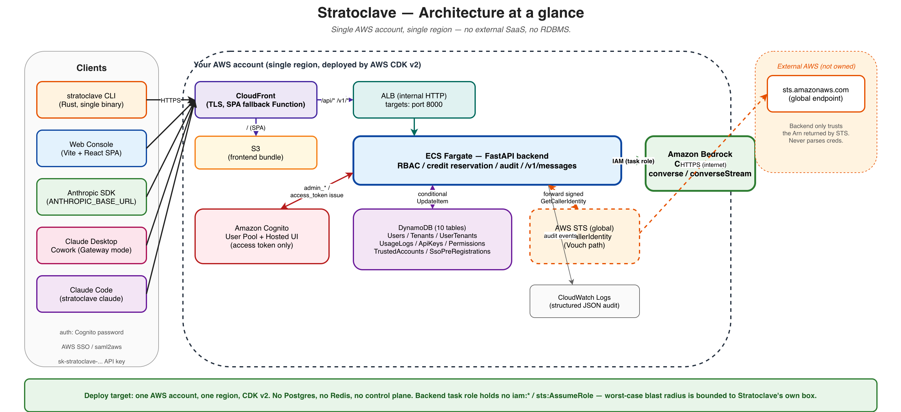
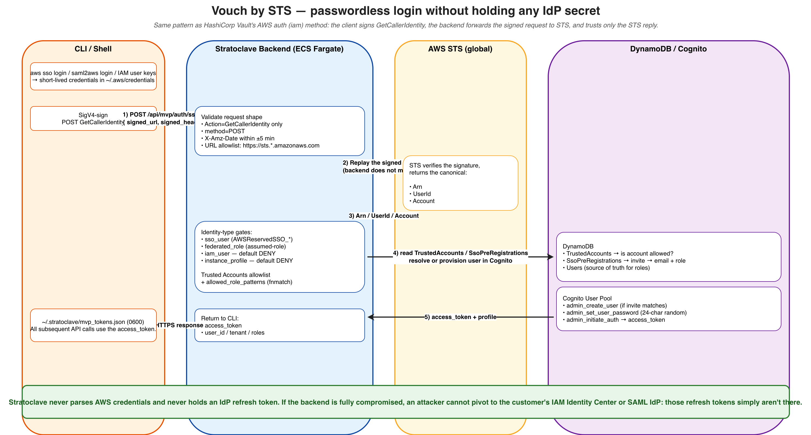
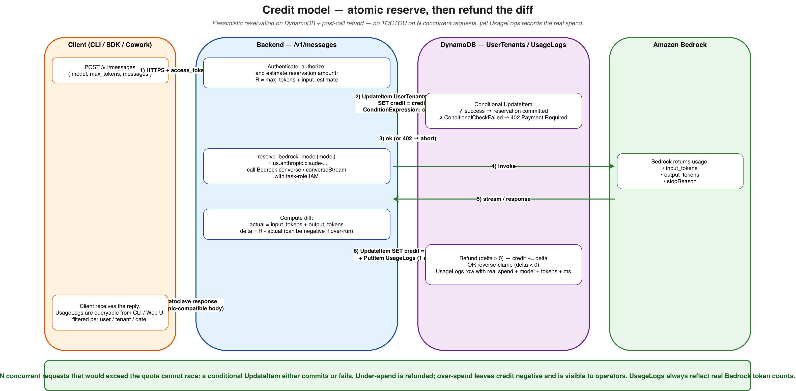

<div align="center">

# Stratoclave

**A tenant-aware credit gateway for Amazon Bedrock.**

[](./LICENSE)
[](#project-status)
[](./backend)
[](./cli)
[](./iac)
[](#api-compatibility)

</div>

---

## Overview

Stratoclave is a self-hosted gateway that sits in front of Amazon Bedrock and
adds the three things raw Bedrock does not give you on its own: **who called
which model, under whose budget, and through which identity**.

It exposes an Anthropic `Messages API`-compatible endpoint, so any client that
speaks `ANTHROPIC_BASE_URL` — the Anthropic SDKs, Claude Code, Claude Desktop
Cowork, custom agents — works unchanged. Behind that endpoint it enforces
per-tenant and per-user credit quotas with atomic DynamoDB reservations,
records every call in an audit log, and accepts three orthogonal identity
paths (Amazon Cognito password, AWS SSO via a Vault-style STS vouch, and
long-lived `sk-stratoclave-*` keys).

Stratoclave is deliberately AWS-native and small: a single region in your own
account, one FastAPI service on ECS Fargate, DynamoDB for all state, Cognito
for token issuance, and AWS CDK v2 for the entire topology. There is no
Postgres, no Redis, no external control plane, and no SaaS dependency.

## Highlights

- **Anthropic-compatible endpoint.** `POST /v1/messages` and `GET /v1/models`
  accept the same payloads as `api.anthropic.com`. Point `ANTHROPIC_BASE_URL`
  at your deployment and the Anthropic SDKs, Claude Code, and Claude Desktop
  Cowork work unchanged.
- **Two-level credit governance.** Every tenant has a default credit, every
  user can carry a per-user override, and every `/v1/messages` call reserves
  tokens atomically with a conditional DynamoDB write before Bedrock is
  invoked. Unused credit is refunded from the real token counts on return.
- **Three role RBAC, tenant-scoped.** `admin`, `team_lead`, and `user` roles
  are normalized into DynamoDB from a versioned
  [`permissions.json`](./backend/permissions.json). Team leads see only the
  tenants they own; other tenants respond 404 even by direct URL.
- **Three identity paths, one backend.** Cognito email + password, passwordless
  AWS SSO (and saml2aws, and any AWS profile) through the Vouch-by-STS flow,
  and long-lived `sk-stratoclave-*` API keys with scope narrowing and
  per-user active-key caps.
- **Claude Desktop Cowork ready.** Cowork's Gateway mode discovers the model
  list via `/v1/models` and streams through `/v1/messages`. A CloudFront
  Function guards against the `/v1/v1/...` double-prefix pitfall.
- **CDK v2, one command.** A single `./scripts/deploy-all.sh` from
  [`iac/`](./iac) provisions the VPC, DynamoDB tables, ECR repository, ALB,
  CloudFront + S3 frontend, Cognito User Pool, and the Fargate service in a
  single AWS region.
- **Auditable by construction.** Every privileged action is emitted as a
  structured JSON log to CloudWatch, keyed by the correlation ID the backend
  injects on ingress.

## Architecture at a glance

<p align="center">
  
</p>

The entire deployment lives inside a single AWS region in your own account.
Clients reach CloudFront for TLS termination; static paths hit S3, API paths
hit an internal ALB fronting a single-task Fargate service. The backend is
stateless — all mutable state lives in DynamoDB, authenticated by either a
Cognito `access_token` or a `sk-stratoclave-*` API key, and every `/v1/*`
call is translated into a Bedrock `converse` / `converseStream` invocation
against an inference-profile allowlist.

For a detailed walkthrough of components, data model, and invariants, see
[`docs/ARCHITECTURE.md`](./docs/ARCHITECTURE.md).

## Quick start

### Deploy to your AWS account

Prerequisites: AWS CLI with an administrator profile, Node.js 18+, Docker or
`finch`, and Bedrock model access enabled for the Claude family in your
region.

```bash
# Clone
git clone https://github.com/littlemex/stratoclave.git
cd stratoclave

# Set your profile / region / deployment prefix
export AWS_PROFILE=your-admin-profile
export CDK_DEFAULT_REGION=us-east-1
export STRATOCLAVE_PREFIX=stratoclave

# One-shot deploy: network, DynamoDB, ECR, ALB, CloudFront, Cognito, Fargate
cd iac
npm install
./scripts/deploy-all.sh
```

The script prints the CloudFront URL at the end — hand that URL to your CLI
users. The first admin user is seeded by a bootstrap script in
[`iac/scripts/`](./iac/scripts); see [`docs/DEPLOYMENT.md`](./docs/DEPLOYMENT.md)
for day-2 operations.

### Use it from the CLI

```bash
# Build the Rust CLI (pre-built releases will follow)
cd cli
cargo build --release
export PATH="$PWD/target/release:$PATH"

# Bootstrap config from /.well-known/stratoclave-config
stratoclave setup https://d111111abcdef8.cloudfront.net

# Sign in (pick one path)
stratoclave auth login --email you@example.com               # Cognito password
stratoclave auth sso   --profile your-aws-sso-profile        # AWS SSO / saml2aws

# Run Claude Code through Stratoclave (claude-code must be installed separately)
stratoclave claude -- "Summarize this repository in one sentence"

# Open the web console in a pre-authenticated tab
stratoclave ui open
```

### Use it from the Anthropic SDK

```python
import anthropic

client = anthropic.Anthropic(
    base_url="https://d111111abcdef8.cloudfront.net",
    api_key="sk-stratoclave-xxxxxxxx...",  # issue via CLI or web console
)
resp = client.messages.create(
    model="claude-sonnet-4-6",
    max_tokens=1024,
    messages=[{"role": "user", "content": "Hello"}],
)
print(resp.content[0].text)
```

For a complete walkthrough including the web console, administrative
workflows, and Cowork configuration, see
[`docs/GETTING_STARTED.md`](./docs/GETTING_STARTED.md).

## How it works

### Vouch by STS (passwordless login)

Stratoclave's SSO flow does not parse AWS credentials and never holds an IdP
refresh token. It is the same pattern
[HashiCorp Vault has used for a decade](https://developer.hashicorp.com/vault/docs/auth/aws)
in its AWS `iam` auth method: the client signs
`sts:GetCallerIdentity`, the backend replays the signed request to STS, and
the backend trusts only the `Arn` / `UserId` / `Account` that STS returns.

<p align="center">
  
</p>

This is what makes the SSO path identity-provider agnostic. Anything that
populates `~/.aws/credentials` works the same way: `aws sso login`,
`saml2aws login`, Entra ID / Okta / ADFS SAML federation, a regular IAM user
with long-lived keys (default DENY unless explicitly allowed per trusted
account), and so on. EC2 instance profiles are rejected by default because
they cannot be attributed to a single human.

Because Stratoclave never stores an IdP refresh token, a full backend
compromise cannot pivot into the customer's IAM Identity Center or SAML IdP.
The worst-case blast radius is bounded to Stratoclave's own resources —
Bedrock overspend, DynamoDB tampering, impersonation within this deployment.
See [`SECURITY.md`](./SECURITY.md) and the *Security considerations* section
of [`docs/ARCHITECTURE.md`](./docs/ARCHITECTURE.md) for the full threat
model.

### Credit reservation

Concurrent requests that would overshoot a quota cannot race. Every
`/v1/messages` call reserves `max_tokens + input_estimate` with a conditional
`UpdateItem` on `UserTenants`, then invokes Bedrock, then refunds the
difference from the real token counts. `UsageLogs` always records the actual
spend, not the reservation.

<p align="center">
  
</p>

The credit model, role matrix, and the underlying DynamoDB tables are
documented in [`docs/ARCHITECTURE.md`](./docs/ARCHITECTURE.md) and
[`docs/ADMIN_GUIDE.md`](./docs/ADMIN_GUIDE.md).

## API compatibility

| Endpoint                         | Behavior                                                            |
|----------------------------------|---------------------------------------------------------------------|
| `POST /v1/messages`              | Anthropic `Messages API` payload; translated to Bedrock `converse` / `converseStream`. |
| `GET  /v1/models`                | Returns the Claude-family inference profiles mapped by the backend. |
| `GET  /.well-known/stratoclave-config` | Unauthenticated discovery document; drives `stratoclave setup`. |
| `POST /api/mvp/auth/sso-exchange`| Vouch-by-STS entry point for CLI SSO login.                         |
| `/api/mvp/admin/*`               | Admin and team-lead operations (user, tenant, credit, usage, trusted accounts, invites). |

The Claude family is the only supported provider. Requests for non-Claude
Bedrock models (Nova, Llama, Mistral, ...) are rejected with HTTP 400 because
the token-accounting and credit-reservation logic is Claude-specific. The
exact mapping lives in [`backend/mvp/models.py`](./backend/mvp/models.py).

## Stratoclave vs. LiteLLM Proxy

Both projects are Bedrock-capable OSS LLM proxies; they optimize for
different constraints. Stratoclave is a focused tool for AWS-only teams that
want to avoid operational dependencies (no Postgres, no Redis, no
per-provider glue); LiteLLM is a general-purpose gateway across 100+
providers with a richer budgeting feature set in its commercial tier.

| Dimension                 | Stratoclave                                                           | LiteLLM Proxy                                                                   |
|---------------------------|-----------------------------------------------------------------------|---------------------------------------------------------------------------------|
| Providers                 | Amazon Bedrock (Claude family)                                        | 100+ (OpenAI, Anthropic, Bedrock, Vertex, Azure, Gemini, Ollama, ...)           |
| State                     | DynamoDB only (serverless)                                            | Postgres required, Redis recommended                                            |
| RBAC                      | admin / team_lead / user, tenant-scoped                               | Proxy / Internal User / Team, global / team / user / key / model budgets        |
| API keys                  | `sk-stratoclave-*`, scope narrowing, cap of 5 active, immediate revoke| Virtual keys with `expires / max_budget / rpm_limit / tpm_limit / models`       |
| SSO / STS                 | Built-in (Vouch by STS, covers `aws sso`, `saml2aws`, IAM users)      | Enterprise tier (Okta / Entra ID / OIDC / SAML)                                 |
| Deploy                    | AWS CDK v2, Fargate from 256 CPU / 512 MiB                            | Docker / Helm / ECS / EKS / Cloud Run; ~4 CPU / 8 GB recommended                |
| License                   | Apache 2.0 (all features OSS)                                         | Dual license (MIT + Commercial); SSO and audit features are commercial          |
| Audit / observability     | `UsageLogs` in DynamoDB + CloudWatch structured JSON                  | Langfuse / Datadog / OpenTelemetry / S3 / GCS / SQS / DynamoDB                  |
| Claude Code integration   | `stratoclave claude -- "..."` wrapper                                 | `ANTHROPIC_BASE_URL` override                                                   |
| Claude Desktop Cowork     | Tested; `/v1/v1` guard in CloudFront Function                         | Possible in principle; not formally documented                                  |

**Pick Stratoclave** when your organization is AWS-native, Bedrock-only,
already uses IAM Identity Center / `saml2aws`, and does not want to run an
RDBMS for a proxy. **Pick LiteLLM** when you need a single proxy across
multiple providers, already operate Postgres, want fine-grained RPM/TPM
budgeting, or need deep integration with third-party observability stacks.

## Documentation

| Document                                                        | For                                                          |
|-----------------------------------------------------------------|--------------------------------------------------------------|
| [`docs/GETTING_STARTED.md`](./docs/GETTING_STARTED.md)          | First run: install the CLI, sign in, make a call.            |
| [`docs/ARCHITECTURE.md`](./docs/ARCHITECTURE.md)                | Components, data model, auth flows, invariants.              |
| [`docs/DEPLOYMENT.md`](./docs/DEPLOYMENT.md)                    | CDK stacks, environment variables, day-2 operations.         |
| [`docs/ADMIN_GUIDE.md`](./docs/ADMIN_GUIDE.md)                  | Tenant / user / credit / trusted-account management.         |
| [`docs/CLI_GUIDE.md`](./docs/CLI_GUIDE.md)                      | `stratoclave` subcommand reference.                          |
| [`docs/COWORK_INTEGRATION.md`](./docs/COWORK_INTEGRATION.md)    | Claude Desktop Cowork (Gateway mode) setup.                  |

Diagram sources are in [`docs/diagrams/`](./docs/diagrams) as both
`*.drawio` (editable in [diagrams.net](https://www.diagrams.net/)) and `*.png`.

## Security

Do **not** open a public issue for suspected vulnerabilities. Use the
private channels described in [`SECURITY.md`](./SECURITY.md) — preferably the
repository's **Security → Report a vulnerability** tab.

In short: Stratoclave's backend task role holds no `iam:*`, no
`sts:AssumeRole`, no `ec2:*`, and no S3 permissions beyond its own
deployment artifacts. It does not store IdP refresh tokens. A full backend
compromise is bounded to this deployment — Bedrock overspend, DynamoDB
tampering, impersonation within this User Pool — and does not reach the
customer's identity source or other AWS services. See the *Security
considerations* section of [`docs/ARCHITECTURE.md`](./docs/ARCHITECTURE.md)
for the detailed attack model and the residual risks that are explicitly
called out (5-minute replay window, invite-only provisioning, DoS of the SSO
exchange endpoint).

## Project status

Stratoclave is **alpha** software. Public HTTP surfaces, DynamoDB schemas,
and CDK construct props may change without notice until `v0.1.0` is cut.
Breaking changes will be called out in release notes from that point on.
Issues and pull requests are welcome; see
[`CONTRIBUTING.md`](./CONTRIBUTING.md).

## Contributing

- [`CONTRIBUTING.md`](./CONTRIBUTING.md) — build, test, and submit changes.
- [`CODE_OF_CONDUCT.md`](./CODE_OF_CONDUCT.md) — community expectations.

The codebase is three languages and one IaC framework (Python FastAPI, Rust
CLI, TypeScript + React frontend, TypeScript CDK). Each component has a
README and can be developed and tested in isolation; the Vite dev server
proxies to the same ALB paths as the production deployment, so you rarely
need the full stack running locally.

## License

Licensed under the [Apache License, Version 2.0](./LICENSE). All features of
Stratoclave are part of the OSS distribution; there is no enterprise tier.

## Acknowledgments

- **[Amazon Bedrock](https://aws.amazon.com/bedrock/)** — the upstream model
  runtime that Stratoclave proxies.
- **[HashiCorp Vault AWS auth method](https://developer.hashicorp.com/vault/docs/auth/aws)**
  — the origin of the signed `GetCallerIdentity` pattern used by Stratoclave's
  Vouch-by-STS flow.
- **[LiteLLM](https://github.com/BerriAI/litellm)** — the gold standard for
  multi-provider LLM proxies and the reference point for Stratoclave's
  design trade-offs.
- **[AWS CDK](https://aws.amazon.com/cdk/)** — the IaC foundation that makes
  `./scripts/deploy-all.sh` possible.
- **[Anthropic SDKs and Claude Code](https://github.com/anthropics)** — the
  client surface Stratoclave is wire-compatible with.
- **[shadcn/ui](https://ui.shadcn.com/)** — primitives used by the web
  console.
